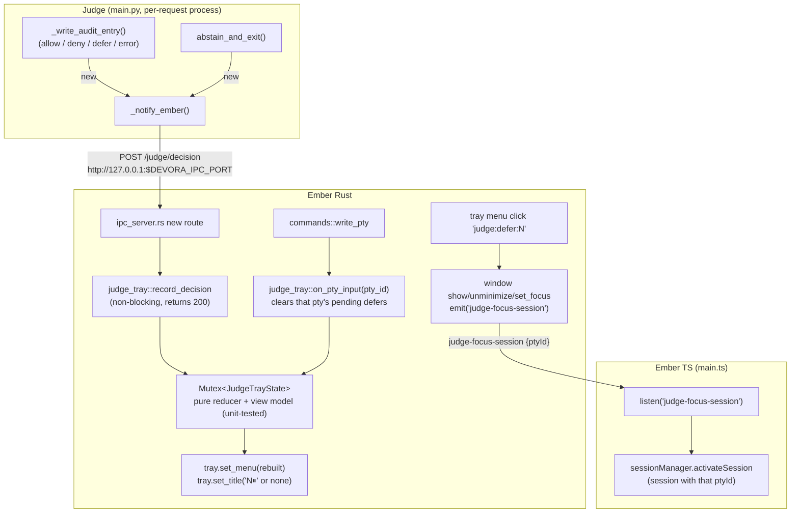

# Judge Decisions in the macOS Menu Bar (Devora-Ember)

**Status**: planned, not yet implemented (designed and crit-reviewed 2026-06-11/12).

## Problem

Judge auto-resolves Claude Code permission requests, but its decisions are invisible — the only trace is `~/.claude/cc-judge-audit.jsonl`. Critically, a **defer** means Claude Code is blocked on a permission prompt waiting for the user, possibly on a background tab. This design surfaces Judge activity in the macOS menu bar (top bar) so the user can glance at activity and can't miss a pending defer.

## Decided requirements

- **Host**: Devora-Ember only (Tauri 2 tray icon). Devora OG is out of scope.
- **Transport**: Judge POSTs decision events to Ember's existing IPC HTTP server (`DEVORA_IPC_PORT`/`DEVORA_PTY_ID` env vars, same channel crit uses). Fire-and-forget, silent when not under Ember.
- **UX**: menu-bar icon with state + counters, plus a dropdown of recent decisions. Defers emphasized (unmissable badge).
- Every dropdown entry states the session (tab name) it came from; **all five outcomes** are surfaced: allow, deny, defer, abstain, error.
- Must not collide with the upcoming session-rename feature.

## Architecture



Tray state + native menu live entirely in Rust. The frontend's roles: pass the session title at PTY creation, and switch tabs on click-to-focus (same pattern as `crit-open-overlay`, `main.ts:134`).

## Key design points

- **Judge emit points — all five decisions emit**: allow/deny/defer/error funnel through `_write_audit_entry()` (`project-judge/main.py:618`) — add `_notify_ember(decision, reason)` at its end (the existing `if _test_mode: return` at line 619 auto-suppresses in tests). Abstain never reaches `_write_audit_entry`, so `abstain_and_exit()` (main.py:677) gains a `reason: str` param (callers at main.py:393-394 pass it) and calls `_notify_ember("abstain", reason)` directly. **Audit-log behavior is unchanged** — abstains stay unlogged there, exactly as today.
- **`_notify_ember(decision, reason)`**: guard order `_test_mode` → both `DEVORA_IPC_PORT` and `DEVORA_PTY_ID` present (else return — zero cost standalone). Lazy `import urllib.request` *after* the env guard (heavy import, Judge runs on every permission request everywhere). `urlopen(..., timeout=0.15)` wrapped in `try/except Exception: pass`. No retries.
- **Payload** (camelCase, matching `CritOpenRequest`):
  ```json
  {"ptyId": 3, "decision": "defer", "toolName": "Bash",
   "summary": "git push origin main", "cwd": "...", "ts": "...", "reason": "bash.no_approved_detector"}
  ```
  `decision` ∈ `allow|deny|defer|abstain|error`. `toolName` is nullable — the invalid-JSON error path (main.py:694) runs before `_input_args` is populated. `summary` from new pure helper `_decision_summary(args)`: Bash → command, Read → file_path, WebFetch → url, else tool name, falling back to the reason when tool_input is absent (error path); collapse whitespace, truncate to 200 chars.
- **Session labels**: each menu entry states which session it came from. `create_pty` (commands.rs:14) gains a `title: Option<String>` param, threaded from `SessionManager.createSession` (`SessionManager.ts:20` — the workspace name or 'Shell') through `TerminalPane` into the invoke (`TerminalPane.ts:154`), and stored as a **mutable** per-session field in `PtyManager` (`pty.rs`) — the single backend source of truth for a session's display name. `judge_tray::record_decision` resolves ptyId → title via a brief `PtyManager` lock and snapshots the label into the entry (a later rename relabels future entries, not past ones). Fallback when the pty is unknown (already closed): basename of the event's `cwd`.
- **Session-rename readiness** (upcoming feature — must not collide): nothing in this design assumes title immutability. When renaming ships, it needs only a small `set_pty_title(id, title)` command updating that same `PtyManager` field, wired to the already-existing `SessionTab.setTitle`/`onTitleChange` hook (`SessionTab.ts:25`, `SessionManager.ts:24`); subsequent Judge entries then carry the new name automatically. The command itself is not implemented in this design (no caller exists yet — YAGNI), but the storage and lookup are built so it drops in without rework. Reminder: a new Tauri command needs the three-place ACL registration (`lib.rs` handler, `build.rs` commands array, `capabilities/main.json`) — see `docs/future/invoke-error-visibility.md`.
- **IPC endpoint** `POST /judge/decision` in `ipc_server.rs` (pattern at `:69`): parse body, call `judge_tray::record_decision`, return 200 immediately — unlike `/crit/open` it must NOT block. No-op if tray failed to init (degrade silently).
- **Tray icon**: `tray-icon` feature flag on the tauri dep; `TrayIconBuilder::with_id("judge")` + `icon_as_template(true)` with a new monochrome 44×44 template PNG (black+alpha; macOS auto-adapts light/dark) at `src-tauri/icons/tray/judge-template.png`. Pending defers shown via `tray.set_title(Some("N⏸"))` — title text beside the icon is the strongest native attention signal; idle = bare icon, no title. Tauri tray/menu setters self-dispatch to the main thread (`run_item_main_thread!`), so calling from the tokio IPC task is safe — but never hold the state mutex across `set_menu`/`set_title`: compute view, drop lock, apply. (APIs verified against tauri 2.11.1; `tray-icon`/`muda`/`chrono` already in Cargo.lock transitively.)
- **Dropdown** (rebuilt wholesale from a pure view model on every change; events are low-frequency):
  ```
  Pending (1)                                  [disabled header]
  ⏸ [ws-7] Bash: git push origin m…    14:32   [id judge:defer:{seq}]
  ─────────
  Recent                                       [disabled header]
  ✓ [ws-7] Bash: ls -la                14:31   [disabled]
  ✗ [api] WebFetch: https://exa…       14:30   [disabled]
  ∅ [ws-7] Edit: src/main.ts           14:29   [disabled]
  ⚠ [api] invalid_json_input           14:28   [disabled]
  ─────────
  Allowed 12 · Denied 3 · Abstained 5 · Errors 1   [disabled]
  Clear history                                [id judge:clear]
  ```
  Markers: ✓ allow, ✗ deny, ⏸ defer, ∅ abstain, ⚠ error. Each entry shows its session label in brackets. Recent capped at 10 newest-first; summaries truncated to 48 chars (char-boundary safe); times are local `HH:MM` (add `chrono = "0.4"`). *Caveat*: abstains (every Edit/AskUserQuestion permission request) share the cap-10 recent list and can crowd out other entries; accepted — the counters line keeps totals visible.
- **Counter reset**: "Clear history" only (resets counts, recent list, pending defers). macOS does not reliably deliver tray click events when a native menu is attached, so reset-on-menu-open is not implementable — the explicit Clear item replaces it.
- **Defer clearing rule**: pending defers for pty X clear when bytes are written to pty X via `commands::write_pty` (`commands.rs:44`) — answering a permission prompt necessarily types into that terminal. Per-pty precise, deterministic in CI, no window-focus dependency. Add `app: AppHandle` param to `write_pty`, call `judge_tray::on_pty_input(&app, id)` after successful write (early-returns when nothing pending; one mutex lock per keystroke is negligible). Accepted caveat: xterm.js auto-replies (DA/DSR) could clear a badge early — rare and benign. Clicking a defer item does NOT clear it (prompt still unanswered).
- **Click-to-focus**: in `on_menu_event` for `judge:defer:{seq}` → `get_webview_window("main")` → `show()/unminimize()/set_focus()`, then `app.emit("judge-focus-session", {ptyId})`; frontend listener mirrors the crit lookup and calls `activateSession` (`SessionManager.ts:63`).
- **Init ordering** in `lib.rs` setup: `judge_tray::init(&handle)` after window build (`lib.rs:87-92`), before `ipc_server::start` (`lib.rs:94`) so the route can't race unmanaged state. Log-and-continue on tray init failure.

## Implementation steps (TDD order)

### Phase 1 — Rust pure core
1. `project-ember/src-tauri/Cargo.toml`: `tauri = { version = "2", features = ["devtools", "tray-icon"] }`; add `chrono = "0.4"`.
2. **New** `src-tauri/src/judge_state.rs` — tests first (`#[cfg(test)]`, same pattern as `pty.rs`):
   - serde: camelCase `JudgeDecisionEvent` parses; bad `decision` rejected (enum `Allow|Deny|Defer|Abstain|Error`, `#[serde(rename_all = "lowercase")]`); nullable `toolName`
   - `record(evt, session_label, now_label)`: per-decision counts increment; defer → pending; recent capped at 10, newest-first; entries carry the session label (label + time passed in so the reducer stays pure and clock-free)
   - `clear_pending_for_pty(x)` removes only x's defers, returns changed-bool; `clear_all()`
   - `title()`: `None` at 0 pending, `Some("2⏸")` at 2 — only defers drive the badge
   - `truncate_summary()`: 48 chars + ellipsis, unicode-safe
   - `view()` → `TrayView` (pure data: items with id/label/enabled/separator) — exact sequence incl. headers, `[session]` labels, ∅/⚠ markers, four-part counters line, and ids
3. Implement until `mise ember-test` green.

### Phase 2 — Judge emitter
4. **New** `project-judge/test_notify.py` (unittest, `import main` like `test_redact.py`) — tests first:
   - thread-spawned `http.server` on ephemeral port; set `DEVORA_IPC_PORT`/`DEVORA_PTY_ID` + `main._input_args`; call `main._notify_ember(...)` for each decision value incl. `"abstain"` and `"error"`; assert POST `/judge/decision` + payload fields (nullable `toolName` on the error path with empty `_input_args`)
   - env vars absent → no request, fast (<50ms); refused port → no exception; `main._test_mode = True` → no request
   - `_decision_summary` per-tool extraction, reason fallback, whitespace collapse, 200-char truncation
5. Implement `_notify_ember` + `_decision_summary` in `main.py`; call at end of `_write_audit_entry`; add `reason` param to `abstain_and_exit` + its `_notify_ember("abstain", reason)` call (update callers at main.py:393-394). Update `project-judge/mise.toml` test task: `./run-tests.py && uv run ./test_redact.py && uv run ./test_notify.py`. Run `mise run -C project-judge test` (the regression cases also prove `--expected` keeps the emitter silent).

### Phase 3 — Ember glue, e2e first
6. **New** `project-ember/tests/features/judge-tray.feature` + `tests/steps/judge.steps.ts` (red first):
   - *Decisions are counted and labeled*: `driver.ipcPost('/judge/decision', {ptyId, decision:'allow', ...})` (and an abstain + an error event) → poll new `GET /test/judge-state` for the per-decision counts and a recent entry carrying the session's tab title
   - *Defer pends, typing clears*: POST defer → poll `pendingCount: 1`, `title: "1⏸"` → write to terminal (real `write_pty` path via existing terminal helper) → poll `pendingCount: 0`, defer still in recent
   - *Focus event switches tabs*: two sessions → `POST /test/emit` `{event:'judge-focus-session', payload:{ptyId}}` → poll active session (pattern in `crit.steps.ts`)
   - Add `harnessGet(path)` to `tests/support/app-driver.ts`
7. Add `src-tauri/icons/tray/judge-template.png` (generate a simple monochrome glyph, black+alpha).
8. **New** `src-tauri/src/judge_tray.rs`: `init`, `record_decision` (resolves ptyId → session title via `PtyManager`, falls back to cwd basename), `on_pty_input`, `sync` (view → `MenuBuilder`/`MenuItemBuilder` → `set_menu` + `set_title`), `handle_menu_event`, `snapshot_json`. Register module + init in `lib.rs`.
9. `ipc_server.rs`: add `/judge/decision` route. `test_harness.rs`: add `GET /test/judge-state` returning `{title, counts: {allow, deny, abstain, error}, pendingCount, recent: [{decision, sessionLabel, summary, ...}]}` (test-mode-only by construction). `commands.rs`: `write_pty` gains `app: AppHandle` + `on_pty_input` call; `create_pty` gains `title: Option<String>` stored on the pty session in `pty.rs`.
10. `mise local-ember-test-e2e` until scenarios 1-2 pass.

### Phase 4 — Frontend
11. Thread the session title from `SessionManager.createSession` (`SessionManager.ts:20`) through `TerminalPane` into the `create_pty` invoke params (`TerminalPane.ts:154`).
12. `project-ember/src/main.ts` (~line 157, beside crit listeners): `listen('judge-focus-session', ...)` → find session by `getPtyId()` → `activateSession`. Scenario 3 green. Frontend changed ⇒ use `mise local-ember-test-e2e` so the binary under test includes the changes.

### Phase 5 — Docs
13. Root `CHANGELOG.md` → `## Unreleased` → `### Added`: menu-bar Judge integration (badge for pending prompts, recent history dropdown with session labels, click-to-focus).
14. `USER_GUIDE.md`: short section on icon states, dropdown (incl. decision markers and session labels), click-to-focus, Clear, and "badge clears when you type in that session". `README.md` Judge bullet: note Ember menu-bar surfacing. `project-judge/README.md` Flow section: paragraph on the best-effort `DEVORA_IPC_PORT` POST.

## Files

**New**: `src-tauri/src/judge_state.rs`, `src-tauri/src/judge_tray.rs`, `src-tauri/icons/tray/judge-template.png`, `project-judge/test_notify.py`, `tests/features/judge-tray.feature`, `tests/steps/judge.steps.ts`

**Modified**: `project-judge/main.py`, `project-judge/mise.toml`, `src-tauri/Cargo.toml`, `src-tauri/src/ipc_server.rs`, `src-tauri/src/lib.rs`, `src-tauri/src/commands.rs`, `src-tauri/src/pty.rs`, `src-tauri/src/test_harness.rs`, `project-ember/src/main.ts`, `project-ember/src/session/SessionManager.ts`, `project-ember/src/terminal/TerminalPane.ts`, `tests/support/app-driver.ts`, `CHANGELOG.md`, `USER_GUIDE.md`, `README.md`, `project-judge/README.md`

## Verification

```sh
mise run -C project-judge test     # regression cases + redact + new test_notify
mise ember-test                    # Rust unit (judge_state) + TS unit
mise local-ember-test-e2e          # rebuild + cucumber incl. judge-tray.feature
```

Manual smoke: open a session, run `ccc`; trigger an auto-allowed command (✓ entry with the session's tab name), a denied one (✗), an Edit permission request (∅ abstain), an unknown one (menu bar shows `1⏸`); click the tray defer item from another app → Ember focuses + switches tab; answer the prompt → badge clears; Clear history empties the menu.
Also run Claude Code in a plain terminal (no `DEVORA_*` env) and confirm unchanged behavior/latency (`duration_us` in the audit log).

**Honest test limits**: the native NSStatusItem itself (icon rendering, title text, menu opening, menu item clicks) cannot be driven by the eval-bridge harness — that slice is covered by Rust view-model unit tests + the manual smoke. Everything up to the native boundary (endpoint → state → title/counters → clear rule → focus event) is automated.

**Scope guard (YAGNI)**: no history persistence across restarts, no Linux/Windows tray, no alert-icon variant, no notification banners. Session renaming itself is out of scope, but the title storage is mutable and the `set_pty_title` extension point is documented above so the upcoming rename feature slots in without rework.
