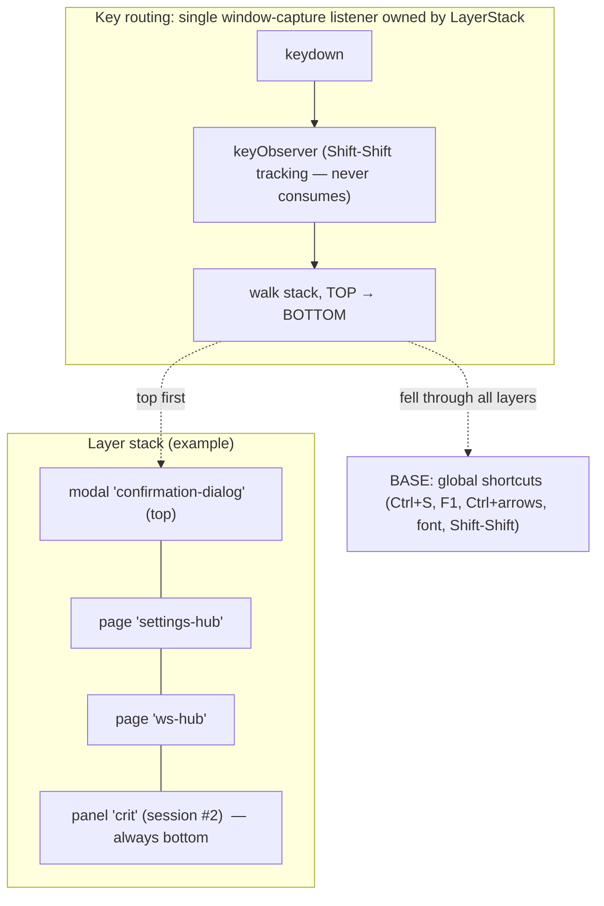
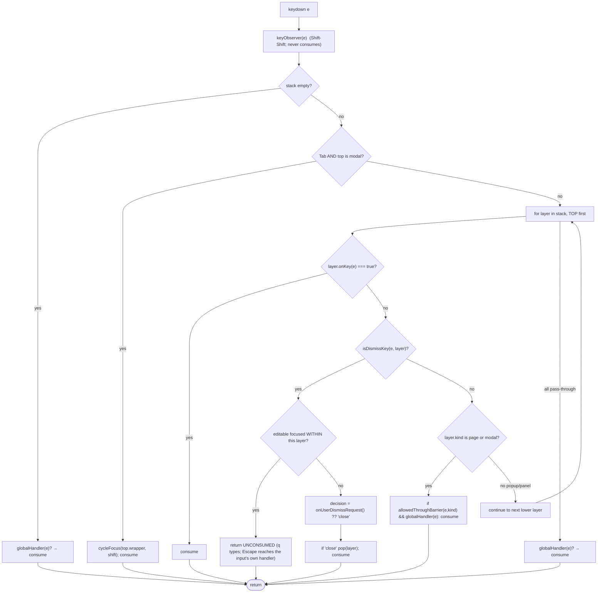

# Ember Layer System — Robust Stacked Pop-ups & Pages

## Context

Devora Ember today has **five uncoordinated keyboard/overlay mechanisms** that were each added for one surface and never unified:

1. `KeyboardShortcuts` — one `window`-capture keydown registered once at startup (`src/ui/KeyboardShortcuts.ts:31`).
2. `OverlayManager` — a single tab-covering slot (second show *replaces* the first) plus a per-session panel `Map` (`src/ui/OverlayManager.ts`).
3. Per-hub `window`-capture keydown handlers added in each hub's `load()` (WorkspaceHub, SettingsHub, HealthHub, CommandPalette).
4. Per-dialog `document`-capture keydown handlers (ConfirmationDialog, TextInputDialog, AddRepoDialog, CloneRepoDialog).
5. DropdownMenu's own `document`-capture handler.

Because capture-phase dispatch runs **window listeners (registration order) → document listeners → target**, and `stopPropagation` does *not* silence sibling window listeners (only `stopImmediatePropagation` does), stacked surfaces mis-route keys. There is **no stack data structure** — "stacking" is emergent and buggy.

We are about to add **more kinds of pop-ups** (per the user: modal dialogs/forms, anchored popovers/menus, **non-modal floating panels**, and more full pages). This plan replaces the ad-hoc machinery with **one `LayerStack`** that owns the only keyboard entry point and manages focus by stack position rather than by whatever happens to be focused.

### Confirmed bugs this design fixes *by construction*

| # | Bug (verified in source) | Root cause |
|---|---|---|
| 1 | Escape/Enter on a ConfirmationDialog stacked over a hub operates the **hub underneath** (dismisses it / activates a row) instead of the dialog | Dialog focuses nothing → editable guard doesn't shield it; `KeyboardShortcuts` window-capture runs first and starves the dialog's `document` handler (`KeyboardShortcuts.ts:56-64`, `ConfirmationDialog.ts:88-99`) |
| 2 | Escape with a DropdownMenu open **closes the whole hub** and leaks the dropdown's `document` listeners | `document`-capture can't beat `window`-capture; the "swallows Escape" comment is false (`DropdownMenu.ts:83-90`) |
| 3 | Hub key handlers stay live under child dialogs (`d`,`d` stacks two dialogs; `j/k/n/R/P/H` operate the hub beneath a modal) | No suppression while a dialog is open; only accidental editable-focus shields it |
| 4 | `q` with the hub cheatsheet open **double-fires** (closes cheatsheet, then closes hub) | `q` handled both globally (`onUserDismiss`) and by the hub's own live window handler (`WorkspaceHub.ts:558-567`) |
| 5 | Panel overlays (crit, task-creation) advertise Esc/q dismissal that is **dead** while the terminal has focus | `showPanelOverlay` never steals focus (`OverlayManager.ts:93-108`); the xterm textarea matches the editable guard, swallowing q/Esc |
| 6 | No dialog restores focus on close; **no Tab trap** exists despite "Focus trapping" comments | Never implemented (`ConfirmationDialog.ts:82`, `TextInputDialog.ts:83`) |
| 7 | Ctrl+←/→ session switching under an open hub **steals focus** to the new terminal (hub keys die) and stales the captured `restoreFocusTo` | Tab-switch shortcuts aren't gated by overlays (`KeyboardShortcuts.ts:88-100`); focus restore uses a target captured at open time |

### User decisions (fixed requirements)

- The page primitive supports **both true stacking** (push; lower page stays alive, revealed with state preserved + a refresh-on-reveal hook) **and replace semantics** — call-site chooses.
- Explicitly accommodate: **modal dialogs/forms, anchored popovers/menus, non-modal floating panels** (unhandled keys pass through to content below), **and more full pages**.
- **Toasts and error banners stay outside** the layer system (passive, on `document.body`).
- **Phased commits**, each keeping the full e2e suite green.
- TDD; smallest reasonable changes; an **ADR-003** documents the architecture; no framework; explicit over implicit.

---

## Architecture

### The stack



A layer is `page | modal | popup | panel`. Exactly one dispatcher; the walk stops at the first layer that consumes the key or at the first **modality barrier** (`page`/`modal`). `popup` and `panel` are **transparent** to unhandled keys (this is what makes non-modal panels work). `panel` layers are inserted at the **bottom** (they represent the session content region and must never intercept a page/modal above them).

### Types — `src/ui/layers/types.ts`

```ts
export type LayerKind = 'page' | 'modal' | 'popup' | 'panel';

// 'close' → pop this layer; 'handled' → the layer did something internal
// (closed a cheatsheet, replaced itself) — key still consumed, no pop;
// 'veto' → refuse (zero-profile lock) — key still consumed.
export type DismissDecision = 'close' | 'handled' | 'veto';

export interface Focusable { focus(): void; }   // moved here from OverlayManager

export interface LayerSpec {
  name: string;                          // 'ws-hub', 'settings-hub', 'confirmation-dialog', ...
  kind: LayerKind;
  element: HTMLElement;                  // popup/panel elements stay where the caller placed them
  onKey?: (e: KeyboardEvent) => boolean; // layer-specific keys, tried FIRST; true = consumed
  onUserDismissRequest?: () => DismissDecision;  // q / Escape / (Ctrl+S for pages)
  onCleanup?: () => void;                // runs exactly once on pop/remove/replace
  onReveal?: () => void;                 // runs when this layer becomes top again after a cover pops
  resolveFocus?: () => Focusable | null; // focus target on push AND on reveal, resolved at that moment
  wrapperClass?: string;                 // e.g. 'overlay-passthrough' for the palette
}

export interface LayerHandle {
  readonly name: string;
  readonly kind: LayerKind;
  readonly element: HTMLElement;
  readonly wrapper: HTMLElement;         // stack-owned wrapper (=== element for popup/panel)
}
```

### Public API — `src/ui/layers/LayerStack.ts`

```ts
export interface LayerStackDeps {
  pageHost: HTMLElement;   // #app     (wrappers reuse the .overlay-tab-covering CSS, class 'layer-page')
  modalHost: HTMLElement;  // document.body (wrapper class 'layer-modal' + `${name}-backdrop`)
  resolveBaseFocus: () => Focusable | null;  // () => sessionManager.getActiveSession()?.terminalPane ?? null
}

class LayerStack {
  constructor(deps: LayerStackDeps);
  install(): void;                                   // registers THE window-capture keydown; call once, first
  setKeyObserver(fn: (e: KeyboardEvent) => void): void;   // sees every keydown; must not consume
  setGlobalHandler(fn: (e: KeyboardEvent) => boolean): void; // base shortcuts; true = consumed

  push(spec: LayerSpec): LayerHandle;                // panel → bottom; others → top
  pop(): void;                                       // top only
  remove(handle: LayerHandle): void;                 // any position; contained popups removed first; no reveal/focus if non-top
  replaceTop(spec: LayerSpec): LayerHandle;          // atomic swap: old cleanup, new mount, ONE focus move, no reveal below
  requestUserDismiss(): boolean;                     // same path as a user q/Escape at the top
  clear(): void;                                     // test/teardown: pop-with-cleanup everything

  isEmpty(): boolean; depth(): number;
  top(): LayerHandle | null; find(name: string): LayerHandle | null; topOf(kind: LayerKind): LayerHandle | null;
}
```

**Invariants** (dev-assert with `console.error`, tolerate in prod, mirroring `OverlayManager`'s try/catch cleanup):
- `remove(handle)` first removes any `popup` layers whose `element` is DOM-contained in `handle.element` — this is how a dropdown auto-closes when its host page is dismissed, with no parent bookkeeping.
- `panel` layers only ever sit at the bottom and never take focus while a `page`/`modal` is above them.

### Key-dispatch algorithm

`consume(e)` = `e.preventDefault(); e.stopImmediatePropagation()`. **`stopImmediatePropagation` is load-bearing** during migration: leftover window-capture handlers (the hubs, until commit 2) must be starved on consumed keys — today's `stopPropagation` is exactly why bug #4 exists.



```
isDismissKey(e, layer):
  (Escape or q, unmodified)                                  → true
  (Ctrl+S, no Shift, code 'KeyS') AND layer.kind === 'page'  → true   // Ctrl+S toggles a page closed, like today
  else                                                       → false

editableFocusedWithin(layer):
  isEditableElementFocused() AND layer.wrapper.contains(document.activeElement)
```

**The palette "type-first" exception needs zero special-casing.** Its search field is focused on open → `q` hits `editableFocusedWithin` and types; Escape passes through to `SearchInput`'s own element keydown, which blurs and calls `onEscape` → close (`SearchInput.ts:39-45`, unchanged). Escape/q with the palette *unfocused* falls into standard dismissal — same as today.

### Modality-barrier matrix

`allowedThroughBarrier(e, 'page')` returns true **only** for F1 and font-size combos. `allowedThroughBarrier(e, 'modal')` is always false. Encode as one explicit function with this table in a comment — no data-driven cleverness.

<table>
<tr><th align="left">Shortcut</th><th>base (empty)</th><th>under panel/popup only</th><th>under page</th><th>under modal</th></tr>
<tr><td>q / Escape</td><td>→ focused el</td><td>dismiss top layer</td><td>route via onUserDismissRequest</td><td>dismiss (cancel) — via modal's onKey</td></tr>
<tr><td>Ctrl+S (WS Hub)</td><td>open hub</td><td>open hub (over panel)</td><td><b>dismiss key</b> (hub: close; Settings: back-to-hub; palette: no-op via its onKey)</td><td>blocked</td></tr>
<tr><td>F1 (User Guide)</td><td>open guide</td><td>open guide</td><td><b>allowed</b> → pushes guide over the page</td><td>blocked</td></tr>
<tr><td>Ctrl+Shift+S (new session)</td><td>allowed</td><td>allowed</td><td><b>blocked</b> (fixes focus-steal, bug #7 class)</td><td>blocked</td></tr>
<tr><td>Ctrl+←/→ (switch tab)</td><td>allowed</td><td><b>allowed</b> (pinned: crit panels + tab switch)</td><td><b>blocked</b> (fixes bug #7)</td><td>blocked</td></tr>
<tr><td>Ctrl+Shift+←/→ (move tab)</td><td>allowed</td><td>allowed</td><td>blocked</td><td>blocked</td></tr>
<tr><td>Font size (Ctrl+1/2/3, Ctrl±)</td><td>allowed</td><td>allowed</td><td><b>allowed</b> (works over hubs today; keep)</td><td>blocked</td></tr>
<tr><td>Shift-Shift (palette)</td><td>allowed</td><td>allowed</td><td>blocked (open guard: no page/modal on stack)</td><td>blocked</td></tr>
</table>

Shift-Shift fires on **keyup**, outside the dispatcher; its open path checks `layers.topOf('page') === null && layers.topOf('modal') === null` (replacing the `commandPaletteOpen` boolean and the `isTabCoveringOverlayActive` guard).

---

## Two corrections to the naive design (verified against source)

### Correction A — modals must handle Escape+Enter in their own `onKey`, *not* the central convention

`TextInputDialog` focuses+selects a **plain `<input>` with no element-level Escape handler** (`TextInputDialog.ts:104-105`); AddRepo focuses a RepoList search, Clone focuses a URL input. If Escape went through the central `editableFocusedWithin → return unconsumed` path, Escape would become a **dead key** for these dialogs (the input has nothing to blur/close it) — a regression from today's single-press cancel.

**Resolution:** the unified `ModalDialog` handles **Escape and Enter in its `onKey`** (which runs *first* in the walk, before the editable guard), returning `true`. It does **not** handle `q` — so `q` falls to the editable guard and types when an input is focused, or hits central dismissal (cancel) when a button is focused. This yields the correct, today-matching asymmetry:

- **Pages** let Escape pass the editable guard to element handlers → the hub search field blurs (`SearchInput`), doesn't close the hub.
- **Modals** consume Escape/Enter in `onKey` regardless of focus → single-press cancel/confirm, exactly as the `document` handlers do today.

`onKey` becomes the single per-layer key entry point; the central convention handles only `q` and the page/base fall-through.

### Correction B — no `OverlayManager` behavioral adapter; migrate via high-level test hooks

The e2e helpers **open** the hub themselves by calling `overlayManager.showTabCoveringOverlay(...)` with production-mirroring closures (`ws-hub-helper.ts:6-17`). An adapter that re-implements `showTabCoveringOverlay` on the stack risks the tests exercising a *different* wiring than production (`main.ts openWsHub`).

**Resolution:** expose **high-level hooks** on `window.__test` (`openWsHub`, `openSettingsHub` (exists), `openHealthHub` (exists), `dismissTopLayer`, `layers`) and migrate the **open/close paths** of the four test helpers to them in commit 2, so tests open surfaces through the **same code path** as production. Keep a **thin read-only query shim** only for the assertion methods still referenced by step files (`isTabCoveringOverlayActive` → `layers.topOf('page') !== null`; `dismissTabCoveringOverlay` → `requestUserDismiss`) until commit 6 deletes it. Panel query methods (`hasPanelOverlay`, `hasAnyVisiblePanelOverlay`, `dismissPanelOverlay`) stay real until commit 5. (~24 call sites across 8 test files; the split keeps per-commit churn small.)

---

## Focus lifecycle

- **push**: mount wrapper (`page`→`pageHost`, `modal`→`modalHost` + `${name}-backdrop`, `popup`/`panel` already placed); wrapper `tabIndex = -1`. If the layer is top (always, except a bottom-inserted panel under existing layers): focus `resolveFocus?.() ?? wrapper` — **except `popup`, which never moves focus**. The palette's `focusSearch()` becomes its `resolveFocus`, deleting the "focus wrapper then override" dance (`main.ts:455-462`).
- **pop / remove-of-top**: `onCleanup` (try/catch + `console.error`, as `dismissTabCoveringOverlay` does today), remove wrapper; then the revealed layer runs `onReveal?.()` and focus `revealed.resolveFocus?.() ?? revealed.wrapper`. **Empty stack** → `resolveBaseFocus()?.focus()` resolved *now* (fixes stale-`restoreFocusTo`, bug #7; deletes every `restoreFocusTo` parameter).
- **remove-of-non-top** (hidden panel closed by backend, popup outside-click): cleanup + detach only, **no focus/reveal** (preserves "backend closes a hidden session's crit overlay without stealing focus").
- **replaceTop**: old cleanup (no reveal below), new mounted+focused once. Preserves the pinned `OverlayManager` test "showing a second overlay runs the first's cleanup".
- **Tab trap (`modal` top only)** — `src/ui/layers/tabTrap.ts`: `collectFocusables(root)` (`button,[href],input,select,textarea,[tabindex]`, drop `disabled`/`tabIndex<0`/hidden), `cycleFocus(root, backwards)` wraps at ends and recovers if focus escaped. Fixes bug #6.
- **xterm**: the terminal's hidden textarea matches the editable guard, but that guard now only matters when the textarea is *inside the top layer's wrapper* — it never is — so overlays/panels dismiss correctly regardless of terminal focus (fixes bug #5's routing half). Panels also take focus when their tab is visible (below), so keys stop feeding an invisible terminal.
- **iframe limitation** (document in ADR-003 + a code comment): the crit overlay hosts an `<iframe src=…>` (`WebContentOverlay.createUrlContent`). Once the user clicks *into* the iframe, keydown fires in the iframe's document and **never reaches the host window** — no layer routing until focus returns to host chrome. This is today's behavior; the layer system cannot change it. Panel-takes-focus-on-activation means q/Esc works until the user deliberately clicks inside the iframe. Sandboxed `srcdoc` guide bodies swallow keys the same way.

---

## Surface mapping

<table>
<tr><th align="left">Surface</th><th>Layer</th><th>What changes (fix)</th><th>What stays</th></tr>
<tr><td><b>WorkspaceHub</b></td><td>page 'ws-hub'</td><td>Delete its <code>window</code> keydown (load/unload, lines 228/518); <code>handleKeyDown</code> → <code>onKey</code> returning boolean, minus its <code>q</code> and cheatsheet-Escape cases (centralized → fixes bug #4 double-fire). <code>onUserDismissRequest</code> = today's <code>handleUserDismiss</code> as a decision: cheatsheet open → close+render → 'handled'; zero-profile → 'veto'; else 'close'. Add <code>reloadData()</code> (the fetch part of <code>load()</code> — profile re-resolve + <code>loadWorkspaces()</code> + <code>preloadAllStatuses()</code>, no toast, no listener) for <code>onReveal</code>. The <code>zeroProfiles</code>-not-reset-in-unload hack (line 129-130) becomes unnecessary — the live hub keeps its state under Settings.</td><td>Cheatsheet stays a boolean render-swap (NOT a layer); <code>? f 1 2 3 j/k/Enter n R P H</code>; zero-profile welcome+lock; search Escape-unfocuses via SearchInput. <b>onKey must keep the <code>isEditableElementFocused()</code> guard</b> so typing <code>n</code> etc. into inputs returns false (the pinned <code>defaultPrevented===false</code> contract).</td></tr>
<tr><td><b>SettingsHub</b></td><td>page 'settings-hub'</td><td><b>Pushed OVER</b> the hub (P / dropdown / burger). <code>onUserDismissRequest</code>: hub beneath → 'close' (pop reveals live hub; its <code>onReveal→reloadData</code> refreshes after profile edits/deletes) — deletes the <code>onClose:()=>openWsHub()</code> reopen hack; no hub beneath (palette path) → <code>replaceTop(hub)</code> → 'handled'. <code>d</code>-dialog no longer stackable and hub keys dead under it (bug #3) — automatic via the modal barrier.</td><td>"q returns to WS Hub" contract; <code>.claude-config-card, .settings-card</code> gating inside its <code>onKey</code>.</td></tr>
<tr><td><b>HealthHub / User Guide</b></td><td>page 'health-hub' / 'user-guide'</td><td>Pushed over whatever is open; default 'close'. <b>Delete both zero-profile reopen hacks</b> (main.ts:476-483, 501-508) — popping reveals the still-alive hub. F1 no-ops if a 'user-guide' layer exists.</td><td>Health <code>r</code> refresh in its <code>onKey</code>.</td></tr>
<tr><td><b>CommandPalette</b></td><td>page 'command-palette' (<code>wrapperClass:'overlay-passthrough'</code>, <code>resolveFocus</code>→search field)</td><td>Window handler → <code>onKey</code>; add Ctrl+S → consume no-op in <code>onKey</code> (pinned mutual-exclusion). Open guard → no page/modal on stack; <code>commandPaletteOpen</code> deleted. <code>closePaletteThen</code> → <code>layers.remove(paletteHandle)</code>.</td><td>Type-first semantics; Shift-Shift; j/k/Enter/f.</td></tr>
<tr><td><b>Confirmation / TextInput dialogs</b></td><td>modal via <code>ModalDialog</code></td><td>Rebuilt on the primitive; per-dialog <code>document</code> keydown + backdrop <code>stopPropagation</code> deleted. Escape/Enter/q correct under stacking (bugs #1,#3) via <b>Correction A</b>; Tab trap + focus restore (bug #6). Confirmation now focuses its confirm button (today: nothing).</td><td>Promise signatures, DOM class names, resolve semantics, empty-input no-op.</td></tr>
<tr><td><b>AddRepo / CloneRepo dialogs</b></td><td>modal via <code>ModalDialog</code>, two-phase</td><td>Same; progress-phase Escape routes to <code>.task-creation-action</code> via <code>onUserDismissRequest</code>→'handled' (moves from a document listener into the dismiss callback).</td><td>Handle API (<code>onSubmit/onCancel/showProgress/close</code>) so <code>main.ts driveCreationDialog</code> is untouched; initial focus (RepoList / URL input).</td></tr>
<tr><td><b>DropdownMenu</b></td><td>popup (anchored in place)</td><td><code>open()</code> pushes a popup layer, <code>close()</code> removes it; the <code>document</code> keydown (lines 84-90) deleted — Escape/q close ONLY the dropdown via central dismissal (fixes bug #2 + listener leak). Auto-closes when its host page is removed (containment rule).</td><td>Outside-click <code>document</code> click listener; anchored positioning; item/select behavior. (Only ever inside pages — WS Hub header, ClaudeConfigCard in Settings — never inside a modal, so popup-z-110-under-modal-9999 can't occur today.)</td></tr>
<tr><td><b>Crit panel overlay</b></td><td>panel (bottom) via <code>SessionPanels</code></td><td>New <code>SessionPanels</code> owns the <code>Map&lt;sessionId,…&gt;</code>; the visible session's panel is a bottom layer that <b>takes focus when its tab is active</b> (fixes bug #5). A dismiss-decision callback replaces the <code>dismissPanelOverlay</code> monkey-patch (user dismissal → notify <code>crit_overlay_dismissed</code> + <code>tabBar.render()</code>). Backend <code>crit-close-overlay</code> → <code>sessionPanels.dismiss(id)</code> (no notify, no focus steal when hidden). <code>SessionManager.activateSession</code> monkey-patch → an explicit activation-listener hook.</td><td>Per-session addressing by ptyId→sessionId; hidden-on-background-tab display toggle; TabBar indicator (swap <code>hasPanelOverlay</code> → <code>sessionPanels.has</code>).</td></tr>
<tr><td><b>Task-creation progress panel</b></td><td>panel via <code>SessionPanels</code></td><td><code>TaskCreationController</code> passes its own dismiss callback (<code>handleDismiss</code>→'handled') — deletes the <code>isCreating()</code> branch of the monkey-patch.</td><td>Cancel-while-running / close-after-failure; tab teardown.</td></tr>
<tr><td><b>Toasts / error banners</b></td><td>not layers</td><td>none</td><td>Passive on <code>document.body</code>, above everything.</td></tr>
</table>

### Visible navigation changes to call out (intended; add/adjust e2e — not regressions)

Because pages now **stack** instead of replacing, and Ctrl+S is a page dismiss key:

1. **F1 while the hub is open**: today the guide *replaces* the hub; now it **stacks over** it, and q/Ctrl+S **reveals the hub** (not the terminal).
2. **Health/Settings opened from the hub**: q/Esc/Ctrl+S **returns to the hub** (was: Settings already did this via a hack; Health now does too).
3. **Ctrl+Shift+S and Ctrl+←/→ are blocked while a page is open** (were silently acting under the hub and stealing focus — bug #7).
4. **`q` now cancels modals and closes dropdowns** (completes the CLAUDE.md vim convention; previously it fell through to the hub — that fall-through *was* bugs #1/#2). `q` with focus in a dialog input still types.

---

## Phased delivery (each commit: unit tests first, full e2e green)

### Commit 1 — LayerStack kernel + ADR-003 (no production wiring)
- **Tests first** — `src/ui/layers/__tests__/LayerStack.test.ts` (style-match `KeyboardShortcuts.test.ts`: real `window` dispatch, happy-dom) and `tabTrap.test.ts`:
  - push/pop/replaceTop/remove ordering; cleanup-exactly-once; `onReveal` on pop but not replaceTop; panel bottom-insertion; contained-popup auto-removal.
  - dispatch: top `onKey` wins; q/Escape pop top; 'handled'/'veto' consume without popping; editable-within-top passes unconsumed; editable in a *lower* layer does **not** shield top; modal barrier blocks a fake global handler; page allowlist admits F1/font only; popup/panel fall through then hit the global handler; Ctrl+S is a dismiss key only for pages; a second `window` listener proves `stopImmediatePropagation` on consumed keys.
  - focus: push focuses resolveFocus/wrapper; popup push doesn't move focus; pop focuses revealed; empty-stack pop calls `resolveBaseFocus` **at pop time** (mutable session stub).
- **Create**: `types.ts`, `LayerStack.ts`, `tabTrap.ts`, a module accessor `src/ui/layers/stack.ts` (`initLayerStack(deps)`/`getLayerStack()`, mirroring ADR-002's "one sanctioned path" — deep call sites like `showConfirmationDialog` can't be threaded a stack), and `docs/adrs/ADR-003-ember-layer-system.md` (Status/Date/Context/Decision/Consequences per ADR-001/002; include the dispatch pseudocode, barrier matrix, focus lifecycle, iframe limitation, toasts-stay-outside).
- **Delete**: nothing. e2e untouched.

### Commit 2 — Pages + global shortcuts onto the stack
- **Tests first**: `src/ui/layers/__tests__/pageRouting.test.ts` — hub push → P pushes Settings → q pops back with `onReveal` called; Settings-alone q `replaceTop`s the hub; zero-profile veto; cheatsheet 'handled' single-fire (regression for #4); palette Ctrl+S no-op; **Ctrl+ArrowRight blocked under a page but fires at base** (regression for #7). New cucumber: "Ctrl+Right with the hub open does not switch tabs and the hub stays keyboard-operable"; extend `profile-management.feature`: "hub filter text survives a round-trip through Settings" (state preservation is newly observable).
- **Change**: `main.ts` (init stack first; wire all five pages as layers; delete `commandPaletteOpen` and both Health/Guide zero-profile hacks; expose `window.__test.{layers, openWsHub, dismissTopLayer}`). `KeyboardShortcuts.ts` (no own keydown; registers `setKeyObserver` + `setGlobalHandler`; keeps its `window` **keyup** for Shift-Shift; its Escape/q branch deleted). WorkspaceHub/SettingsHub/HealthHub/CommandPalette (window handlers → `onKey`; WorkspaceHub gains `reloadData()`). Migrate the **open/close paths** of `ws-hub-helper.ts`/`hooks.ts` to the new high-level hooks (Correction B); thin query shim for `isTabCoveringOverlayActive`/`dismissTabCoveringOverlay` still used by step files.
- **Delete**: `KeyboardShortcuts` dismissal branch; both hub-reopen closures in main.ts; `commandPaletteOpen`. `OverlayManager` panel APIs stay untouched this commit.

### Commit 3 — `ModalDialog`; four dialogs become modal layers
- **Tests first**: `src/ui/components/__tests__/ModalDialog.test.ts` — Enter confirms; Escape AND q cancel; q in the text input types; Tab cycles; focus restored to revealed layer on close; backdrop click cancels; two-phase Escape forwards to `.task-creation-action`. New cucumber (extend `profile-management.feature`, `workspace-operations.feature`): "Escape on the delete-profile confirmation keeps the Settings Hub open"; "Enter on the confirmation confirms instead of activating the hub row"; "pressing d twice opens only one dialog"; "q closes the Remove Task dialog and the hub stays open". These go through `ui.pressKey` (window dispatch) — dialogs become keyboard-testable for the first time.
- **Change**: rebuild `ConfirmationDialog.ts`, `TextInputDialog.ts`, `AddRepoDialog.ts`, `CloneRepoDialog.ts` on `showModalDialog` (public signatures + DOM class names frozen).
- **Delete**: all four `document`-capture handlers + backdrop `stopPropagation`; `OverlayManager.showPopup/showDialog` stubs (no callers — verified).

### Commit 4 — DropdownMenu as popup layer
- **Tests first**: DropdownMenu×stack unit — Escape closes only the dropdown; host page's `onKey` not consulted; dropdown removed when its host page is removed; no leaked `document` listeners either path (regression for #2). Cucumber (`workspace-hub.feature`): "Escape with the profile dropdown open closes the dropdown, keeps the hub"; second Escape closes the hub.
- **Change**: `DropdownMenu.ts` `open()/close()` push/remove a popup layer; keydown deleted; outside-click routed through `layers.remove`.

### Commit 5 — Panels via `SessionPanels`; monkey-patches die
- **Tests first**: `SessionPanels.test.ts` — show/hide on activation; visible panel is bottom layer, focused only when top; q dismisses visible panel with the callback consulted; hidden-panel backend dismissal doesn't steal focus; panel under a page leaves the page's routing alone; Ctrl+←/→ passes through a panel. Cucumber: extend `crit-overlay.feature` with "q dismisses the crit overlay while the terminal had focus" (`pressKeyRaw`, pins the #5 fix); keep every per-tab/crit/task-creation scenario green.
- **Change**: `SessionPanels.ts`; `SessionManager` gains an explicit activation-listener hook (replacing the `activateSession` wrap, main.ts:55-59); `TaskCreationController` takes `SessionPanels` and passes its dismiss callback; crit listeners rewired; `TabBar` queries `SessionPanels`; panel query methods migrate off `OverlayManager`.
- **Delete**: both main.ts monkey-patches; `OverlayManager`'s panel map.

### Commit 6 — Kill the shim
- **Change**: migrate remaining `window.__test.overlayManager` step references to `layers`/`sessionPanels`; update the "Overlay system" section of `project-ember/CLAUDE.md` to describe layers.
- **Delete**: `src/ui/OverlayManager.ts`, `src/ui/__tests__/OverlayManager.test.ts`, `overlayManager` from `window.__test`.

---

## Intermediate-state safety (commit ordering)

During commit 2–4, dialogs/dropdowns still use `document`-capture handlers. A dialog/dropdown over a page: the stack consumes Escape at the page layer (`stopImmediatePropagation`), starving the child's `document` handler — **identical to today** (`KeyboardShortcuts.stopPropagation` already starves them and dismisses the page). No pinned e2e regresses because **dialog interactions in e2e are click-driven** and stay green until commit 3/4 add the keyboard scenarios alongside the fix. Every intermediate state is **no worse than today**.

## Risks & mitigations

1. **e2e drives keys on `window` only** and `pressKey` pre-blurs focus inside `.ws-hub/.command-palette/.settings-hub` (`ui-driver.ts`): the single window-capture dispatcher is exactly compatible; the new wrapper *contains* those panels, so the blur logic is unchanged. Verify with one full e2e run early in commit 2.
2. **WKWebView late-focus quirk** (`ws-hub-helper.ts:76-77`): design tolerates it because routing never depends on focus — only literal-typing does, and tests blur first. Do **not** add "refocus wrapper on blur" logic; it fights WebKit.
3. **`reloadData()` vs `unload()`/`refresh()`**: `unload()` (line 517) tears down and must run only on true close; `refresh()` (line 328) fires toasts. `reloadData()` reuses the private `loadWorkspaces()` + active-profile re-resolve **without** toasts or listener churn, preserving filter/cursor. Pin "filter survives Settings round-trip" and "delete last profile in Settings → revealed hub shows the zero-profile welcome" (the `zeroProfiles` transition must be re-derived on reveal).
4. **happy-dom focus/`offsetParent` fidelity**: keep `tabTrap.ts` pure and test collection/cycling with elements happy-dom handles; add one **real-WKWebView** cucumber Tab-cycle scenario inside the delete-profile dialog.
5. **Crit iframe swallows keys once clicked into**: documented limitation, unchanged; panel-takes-focus-on-activation means q/Esc works until the user clicks inside the iframe.
6. **Adapter drift**: eliminated by Correction B — tests open surfaces through the same hooks production uses; only read-only queries go through a shim, deleted in commit 6.

## Verification (end-to-end)

- **Unit**: `mise test-unit` — new suites (`LayerStack`, `tabTrap`, `pageRouting`, `ModalDialog`, `SessionPanels`) plus the existing dialog/dropdown/OverlayManager suites stay green until their owner is migrated/deleted.
- **Acceptance**: `mise test-e2e` (rebuilds the bundle on content change; `-- --force` to force). Must stay green each commit; new scenarios above pin the fixed cross-layer behaviors.
- **Manual smoke** (use the Ember visual-verification recipe — `DEVORA_TEST_MODE` app + eval bridge, screencapture from the main shell): open hub → P (Settings stacks) → q (reveals hub with filter intact); open a Remove-Task confirmation over the hub → Escape cancels the dialog only, hub stays; open the profile dropdown → Escape closes just the dropdown; F1 over the hub → q reveals the hub; trigger a crit panel → q dismisses it while the terminal had focus; Ctrl+→ under the hub does nothing.
