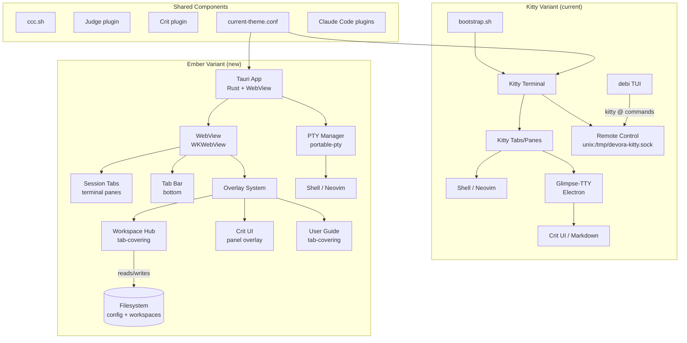
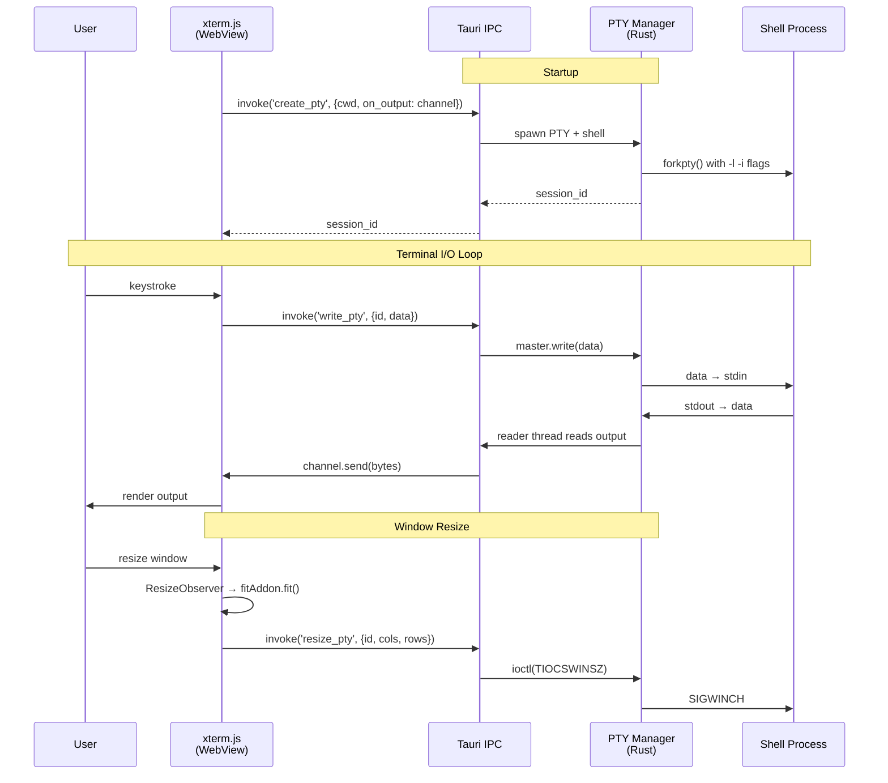
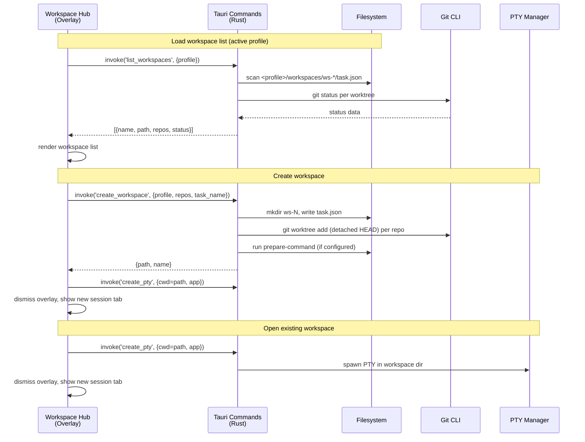
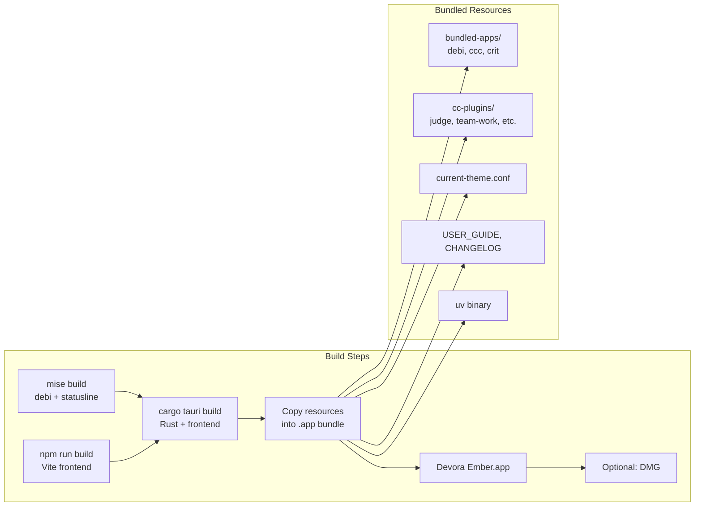
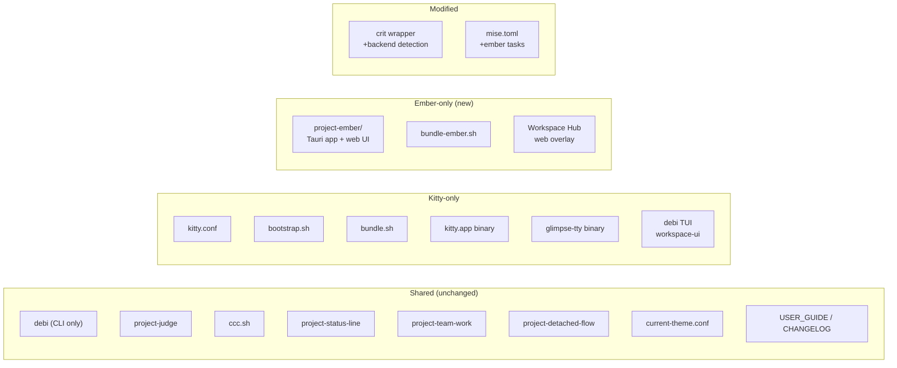

# Plan: Devora Ember — Tauri + xterm.js Variant of Devora

## Status

The PoC is complete. All six phases have been implemented:

- Phase 1: UI Mockups -- done
- Phase 2: Scaffold + Bare Terminal -- done
- Phase 3: Session Tabs + Overlay System -- done
- Phase 4: Workspace Management -- done
- Phase 5: Web Content + Theme + Crit -- done
- Phase 6: Build, Bundle, Polish -- done

### Deviations from the plan

- Markdown rendering uses `marked` (JS-side) instead of `markdown-rs` (Rust-side), as the simpler approach was sufficient for the PoC
- The Crit integration uses a lightweight HTTP server (`ipc_server.rs`) for communication between the crit script and the Tauri app
- Workspace deletion and deactivation from the Workspace Hub are deferred (see `DEFERRED.md`)
- Split panes, pop-up overlays, dialog overlays, and tab drag-and-drop are deferred (see `DEFERRED.md`)

---

## Context

Devora currently uses **Kitty** (terminal emulator) as its UI container and **Glimpse-TTY** (Electron-based) to render web content inside Kitty. This plan adds a second variant — **Devora Ember** — that replaces both with **Tauri** (Rust desktop framework + WebView) and **xterm.js** (JS terminal library). The two variants will coexist in the codebase and build independently.

**Why**: Tauri eliminates the need for both Kitty and the Electron-based Glimpse-TTY. The WebView natively renders web content (Crit UI, markdown docs), and xterm.js provides the terminal. This reduces bundled dependencies and opens the door to a richer, more customizable UI.

**Key architectural decisions**:
- The Workspace Hub (currently debi's Bubble Tea TUI) is **reimplemented natively** as a web UI in the Tauri frontend. In Ember mode, debi functions as a CLI tool only — no changes to debi for the PoC.
- The app uses an **overlay system** for the Workspace Hub, User Guide, Crit, and future dialogs — taking advantage of web UI capabilities that weren't possible in Kitty.
- All colors flow through a **centralized CSS custom properties sheet**, enabling future theming.

**Deferred items**: Split panes are out of scope for the initial PoC, though the session tab architecture is designed to accommodate them. `project-ember/DEFERRED.md` tracks deferred items.

---

## Legend

| Term | Description |
|------|-------------|
| **Session tab** | A tab in the tab bar. Contains a main panel area that currently holds a single terminal pane. In the future, a session tab will support multiple panes (splits) including terminal, markdown, and HTML panes. |
| **Terminal pane** | An xterm.js terminal instance connected to a PTY. Currently each session tab has exactly one. |
| **Tab bar** | Horizontal strip at the bottom of the window showing all open session tabs. |
| **Main panel area** | The content area above the tab bar. Displays the active session tab's content (terminal pane, or future split layout). |
| **Overlay** | A layer rendered on top of the main panel area (and optionally the tab bar). Used for the Workspace Hub, User Guide, Crit, and future dialogs. |
| **Tab-covering overlay** | An overlay that covers the entire window including the tab bar. Used for the Workspace Hub and User Guide. |
| **Panel overlay** | An overlay that covers only the main panel area, tied to a specific session tab. The tab bar remains visible. Used for Crit. Follows tab switching (hidden when the tab is inactive, restored when active). |
| **Workspace Hub** | The workspace management UI shown as a tab-covering overlay. Lists workspaces for the active profile, allows creating and opening workspaces. |
| **Profile** | A named configuration scope in Devora with its own root directory, repo list, and settings. |
| **Workspace** | A set of git worktrees (one per repo) tied to a task, stored in `<profile>/workspaces/ws-N/`. |

---

## Architecture Overview

### Devora Ember vs Kitty Variant



### Window Layout

```
┌──────────────────────────────────────────────┐
│                                              │
│              Main Panel Area                 │
│     (active session tab's content:           │
│      terminal pane, or future splits)        │
│                                              │
│                                              │
│                                              │
│                                              │
├──────────────────────────────────────────────┤
│  [ws-1]  [ws-2]  [Shell]           [+]       │  ← Tab bar (bottom)
└──────────────────────────────────────────────┘
```

Tab-covering overlay (Workspace Hub, User Guide):

```
┌──────────────────────────────────────────────┐
│ ╔══════════════════════════════════════════╗  │
│ ║                                          ║  │
│ ║     Tab-Covering Overlay Content         ║  │
│ ║    (Workspace Hub or User Guide)       ║  │
│ ║                                          ║  │
│ ║                                          ║  │
│ ║                                          ║  │
│ ╚══════════════════════════════════════════╝  │
│            tab bar hidden                    │
└──────────────────────────────────────────────┘
```

Panel overlay (Crit, tied to a session tab):

```
┌──────────────────────────────────────────────┐
│ ╔══════════════════════════════════════════╗  │
│ ║                                          ║  │
│ ║       Panel Overlay Content              ║  │
│ ║       (Crit review UI)                   ║  │
│ ║                                          ║  │
│ ║                                          ║  │
│ ║                                          ║  │
│ ╚══════════════════════════════════════════╝  │
├──────────────────────────────────────────────┤
│  [ws-1]  [ws-2*]  [Shell]           [+]      │  ← Tab bar visible, *=has overlay
└──────────────────────────────────────────────┘
```

### Overlay Modes

| Mode | Covers tab bar? | Tied to tab? | Size | PoC status | Use case |
|------|----------------|--------------|------|-----------|----------|
| **Tab-covering** | Yes | No | Full window | Implemented | Workspace Hub, User Guide |
| **Panel** | No | Yes | Main panel area | Implemented | Crit |
| **Pop-up** | No | No | ~80% centered | Deferred | Add worktree dialog |
| **Dialog** | No | No | Small centered | Deferred | Yes/no prompts |

### PTY Data Flow



### Workspace Data Flow



---

## Phase 1: UI Design (Mockups)

**Goal**: Create HTML mockups to align on visual design before implementing.

### Mockups to create

Each mockup is a static HTML file in `project-ember/mockups/` viewable in a browser.

All mockups use a **centralized CSS custom properties sheet** (`mockups/theme.css`) defining all colors as CSS variables:

```css
/* theme.css — Catppuccin Macchiato defaults */
:root {
  --color-bg:         #24273A;
  --color-surface:    #1E2030;
  --color-overlay:    #363A4F;
  --color-text:       #CAD3F5;
  --color-subtext:    #A5ADCB;
  --color-accent:     #C6A0F6; /* mauve */
  --color-green:      #A6DA95;
  --color-red:        #ED8796;
  --color-yellow:     #EED49F;
  --color-blue:       #8AADF4;
  --color-tab-bar-bg: #181926;
  --color-tab-active: #C6A0F6;
  --color-tab-inactive: #1E2030;
  /* ... terminal colors (color0-15) loaded from current-theme.conf at runtime */
}
```

1. **`main-layout.html`** — The overall window layout:
   - Tab bar at **bottom** showing session tabs
   - Main panel area filling the rest of the window
   - Active/inactive session tab styling
   - Font, colors, spacing

2. **`workspace-hub.html`** — The Workspace Hub (tab-covering overlay):
   - List of workspaces for the **currently-selected profile**
   - Each workspace shows: name, task title, repo count, git status indicators
   - "Open" and "New Workspace" actions
   - Profile selector (if multiple profiles)
   - Search/filter capability

3. **`web-content-overlay.html`** — Web content rendering (panel overlay):
   - Markdown document rendered with theme-styled HTML
   - Tab bar remains visible at bottom
   - Dismiss button

### Design principles

- Dark theme (Catppuccin Macchiato) — all colors via CSS custom properties
- Minimal chrome — the terminal is the focus
- Tab bar should feel native, not like a browser tab bar

**Deliverable**: HTML mockups reviewed and approved before implementation begins.

---

## Phase 2: Scaffold and Bare Terminal

**Goal**: A Tauri window with one xterm.js terminal pane connected to a real PTY.

### 2.1 Scaffold `project-ember/`

```
project-ember/
├── src-tauri/
│   ├── Cargo.toml            # deps: tauri, portable-pty, serde, serde_json, tokio
│   ├── tauri.conf.json
│   ├── build.rs
│   ├── capabilities/
│   │   └── main.json         # ACL permissions
│   └── src/
│       ├── main.rs
│       ├── lib.rs            # setup, command registration
│       ├── pty.rs            # PTY manager
│       └── commands.rs       # Tauri command handlers
├── src/                      # Web frontend (Vite + TypeScript)
│   ├── index.html
│   ├── main.ts
│   ├── styles/
│   │   ├── theme.css         # Centralized color variables
│   │   └── main.css          # Layout styles, references theme.css vars
│   └── terminal/
│       └── TerminalPane.ts   # xterm.js Terminal + PTY binding
├── mockups/                  # HTML mockups from Phase 1
├── package.json
├── vite.config.ts
├── tsconfig.json
├── DEFERRED.md
└── README.md
```

### 2.2 PTY Backend (Rust)

`src-tauri/src/pty.rs`:

- Use `portable-pty` crate
- `PtyManager`: holds `HashMap<u32, PtySession>`, managed via Tauri `.manage()` state
- `PtySession`: PTY master, child process, background reader thread
- Reader thread sends output via `Channel<Vec<u8>>`
- Set env: `TERM=xterm-256color`, `COLORTERM=truecolor`
- Spawn shell with `-l -i` flags (login + interactive, matching `bootstrap.sh`)

Tauri commands in `src-tauri/src/commands.rs`:

| Command | Signature | Description |
|---------|-----------|-------------|
| `create_pty` | `(cwd, shell, env, app_command, on_output: Channel<Vec<u8>>) -> u32` | Spawn PTY, start reader, return session ID |
| `write_pty` | `(id, data: Vec<u8>)` | Forward user input to PTY master |
| `resize_pty` | `(id, cols, rows)` | `ioctl(TIOCSWINSZ)` + SIGWINCH |
| `close_pty` | `(id)` | Kill child, clean up session |

### 2.3 Frontend Terminal (TypeScript)

`src/terminal/TerminalPane.ts`:

1. Create xterm.js `Terminal` — theme colors from CSS custom properties in `theme.css`
2. Load addons: `FitAddon`, `WebglAddon` (with context-loss fallback), `Unicode11Addon`
3. `invoke('create_pty', ...)` with a `Channel` that calls `term.write(new Uint8Array(data))`
4. Wire `term.onData` → `invoke('write_pty', ...)`
5. Wire `term.onResize` → `invoke('resize_pty', ...)`
6. `ResizeObserver` on container → `fitAddon.fit()`

### 2.4 Tests

- Rust unit tests: PTY spawn/read/write/resize/close lifecycle
- Integration: spawn PTY, write `echo hello`, verify output

### 2.5 Build integration

Add to root `mise.toml`:
```toml
[tasks.ember-dev]
description = "Run Devora Ember in development mode with hot reload"
run = "cd project-ember && cargo tauri dev"

[tasks.ember-build]
description = "Build Devora Ember for release"
run = "cd project-ember && cargo tauri build"
```

**Deliverable**: Type shell commands, see output, window resize works. Single terminal pane, no session tabs.

---

## Phase 3: Session Tabs + Overlay System

**Goal**: Multiple session tabs with keyboard navigation. Overlay system with tab-covering and panel modes.

### 3.1 Session tab data model

`src/session/SessionTab.ts`:
- Each session tab has: ID, title, and a content container
- Currently the content is a single `TerminalPane`; the architecture allows future extension to split layouts with mixed pane types (terminal, markdown, HTML)
- On close: `invoke('close_pty')` for each PTY in the session

`src/session/SessionManager.ts`:
- Ordered list of `SessionTab` instances
- Active tab tracking, create/close/switch/reorder operations

### 3.2 Tab bar UI

`src/ui/TabBar.ts`:
- Horizontal strip at **bottom** of window, styled via `theme.css` custom properties
- Active session tab visually distinct, close button per tab
- Tab titles from `term.onTitleChange`
- Visual indicator when a tab has a panel overlay active
- `[+]` button to create new shell session

### 3.3 Overlay system

`src/ui/OverlayManager.ts`:

**Tab-covering overlay**:
- Covers entire window (main panel + tab bar)
- Not tied to any session tab
- Only one tab-covering overlay at a time
- Dismiss on `Escape` or explicit action
- Used for: Workspace Hub, User Guide

**Panel overlay**:
- Covers only the main panel area; tab bar remains visible
- **Tied to a specific session tab** — stored as part of the session's state
- When switching away from a session that has a panel overlay, the overlay is hidden (the tab switching just works naturally)
- When switching back to that session, the panel overlay is restored
- Dismiss on `Escape` or when the Crit process exits
- Used for: Crit review UI

API: `showTabCoveringOverlay(content)`, `showPanelOverlay(sessionId, content)`, `dismissOverlay()`, `getActiveOverlay(sessionId)`

Pop-up and dialog modes are stubs that log a warning (deferred).

### 3.4 Keyboard shortcuts

`src/ui/KeyboardShortcuts.ts` — window-level `keydown` listeners intercepting before xterm.js:

| Shortcut | Action |
|----------|--------|
| `Ctrl+S` | Toggle Workspace Hub (tab-covering overlay) |
| `Shift Shift` | Alias for Ctrl+S (rapid double-press, ~300ms window) |
| `Ctrl+Shift+S` | New shell session tab |
| `Ctrl+Left/Right` | Previous/next session tab |
| `Ctrl+Shift+Left/Right` | Move session tab backward/forward |
| `Ctrl+=/-` | Increase/decrease font size |
| `Ctrl+1/2/3` | Set font size 12/15/26 |
| `Ctrl+Shift+V`, `Cmd+V` | Paste |
| `Escape` | Dismiss active overlay |

The "Shift Shift" detection: track `keyup` events for `Shift` (no other key pressed between). Two `Shift` keyups within ~300ms trigger the Workspace Hub.

### 3.5 Tests

- Session tab create/switch/close lifecycle
- PTY cleanup on session close (no zombie processes)
- Keyboard shortcut dispatch
- Tab-covering overlay show/dismiss lifecycle
- Panel overlay tied to session tab: show, switch away, switch back, dismiss
- "Shift Shift" detection timing

**Deliverable**: Multi-session-tab terminal with tab bar at bottom, overlay system (tab-covering + panel modes).

---

## Phase 4: Workspace Management

**Goal**: Workspace Hub with workspace listing, creation, and opening. No changes to debi.

### 4.1 Rust workspace commands

Tauri commands that read/write the filesystem directly:

| Command | What it does | Returns |
|---------|-------------|---------|
| `list_profiles` | Reads `~/.config/devora/config.json` → `profiles`, then each profile's `config.json` | `[{name, path, repo_count}]` |
| `list_workspaces` | Scans `<profile>/workspaces/ws-*/task.json` | `[{id, name, path, task_title, repos, active}]` |
| `get_workspace_status` | Runs `git status` per worktree | `[{repo, branch, modified, untracked}]` |
| `get_default_app` | Reads `terminal.default-app` from config | `String` |
| `create_workspace` | Creates workspace dir, git worktrees, task.json | `{path, name}` |
| `get_registered_repos` | Reads profile's repo list | `[{name, path}]` |
| `get_prepare_command` | Reads `prepare-command` from config | `Option<String>` |

**Workspace creation flow** (mirrors debi's internal logic):
1. Determine next `ws-N` number from existing workspace dirs
2. Create `<profile>/workspaces/ws-N/` directory
3. For each selected repo: `git worktree add <ws-N>/<repo-name> --detach origin/<default-branch>`
4. Write `task.json` with title and repo metadata
5. Run `prepare-command` if configured (shell command in the workspace directory)

These read/write the same files debi uses internally:
- `~/.config/devora/config.json`: global config with `profiles` array
- `<profile-path>/config.json`: profile name, repos, overrides
- `<profile-path>/workspaces/ws-N/task.json`: task title, metadata

### 4.2 Workspace Hub component

`src/workspace/WorkspaceHub.ts`:
- Rendered as a **tab-covering overlay** (covers entire window including tab bar)
- Shows workspaces for the **currently-selected profile** only
- Each workspace card: name, task title, repo count, git status badges
- Click workspace → opens a new session tab in that directory → dismisses overlay
- "New Workspace" button → inline form: task name + repo selection checkboxes
- Profile selector at top (dropdown) if multiple profiles exist
- Search/filter bar
- The app that runs in opened session tabs: `terminal.default-app` config value

### 4.3 App startup

When Ember starts:
1. Open the Workspace Hub as a tab-covering overlay (no session tabs yet)
2. User creates or selects a workspace → session tab opens → overlay dismisses
3. Ctrl+S or Shift+Shift brings the overlay back at any time

### 4.4 Environment setup for spawned PTYs

Mirror `bootstrap.sh` lines 38-50:
- Set `DEVORA_RESOURCES_DIR` pointing to the app bundle's Resources
- Prepend `bundled-apps/` and cc-plugin `bin/` dirs to `PATH`
- Set `DEVORA_EMBER=1` so scripts can detect the variant
- Set `SHELL` from system default

### 4.5 Tests

- Workspace listing: reads config and task.json files correctly
- Workspace creation: creates dir, worktrees, task.json
- Profile listing: handles single and multiple profiles
- Profile-scoped filtering
- Open workspace: creates session tab with correct cwd and app

**Deliverable**: App opens with Workspace Hub, user can create and open workspaces in session tabs.

---

## Phase 5: Web Content + Theme + Crit

**Goal**: Web content rendering via panel overlays, dynamic theme loading, Crit integration.

### 5.1 Web content panel overlay

`src/webview/WebContentOverlay.ts`:
- **Panel overlay** tied to a session tab (tab bar remains visible)
- For URLs (Crit UI): embedded `<iframe>` filling the overlay
- For markdown files: read via Tauri command, render to themed HTML
- Markdown rendering: evaluate `markdown-rs` (Rust-side, supports GFM + MDX, outputs AST for structured rendering) vs `marked` (JS-side, simpler). Prefer `markdown-rs` if AST→HTML with theme conformance is valuable.

New Tauri commands:
- `read_text_file(path) -> String`
- `render_markdown(content) -> String` (if using markdown-rs on the Rust side)

### 5.2 Wire up shortcuts

| Shortcut | Action |
|----------|--------|
| `F1` | Open User Guide (`USER_GUIDE.md`) as tab-covering overlay |

### 5.3 Dynamic theme loading

`src-tauri/src/theme.rs`:
- Parse `kitty-configs/current-theme.conf` (format: `key #HEXCOLOR`)
- Map to CSS custom property names matching `theme.css`
- Expose via `get_theme()` Tauri command
- Frontend loads at startup, updates CSS custom properties dynamically — all UI automatically re-themes

Both variants share `kitty-configs/current-theme.conf`.

### 5.4 Crit integration

Update `project-crit-integration/bin/crit`:
- Detect backend: if `DEVORA_EMBER=1` env is set, use Ember mode
- Ember mode: instead of `kitty @ launch glimpse-tty`, communicate with the Tauri app to open a **panel overlay** on the current session tab with the Crit URL
- The panel overlay shows the Crit web UI in an `<iframe>` over the current session's main panel area, tab bar remains visible
- When the user switches to another session tab, the Crit overlay hides; switching back restores it
- When Crit finishes (process exits), the panel overlay auto-dismisses
- Kitty mode: existing `kitty @ launch glimpse-tty` behavior (unchanged)

Communication mechanism for the crit script → Tauri app: a lightweight Unix socket or a simple HTTP endpoint on localhost that the Tauri app listens on. The script sends `{"action": "open_panel_overlay", "url": "http://localhost:PORT"}` and the app opens the overlay.

### 5.5 Additional xterm.js addons

- `@xterm/addon-web-links` — clickable URLs
- `@xterm/addon-clipboard` — OSC 52 clipboard (Neovim/tmux)
- `@xterm/addon-search` — find-in-terminal

### 5.6 Tests

- Theme parsing round-trip with `current-theme.conf`
- Panel overlay: show tied to session, switch tabs, switch back, dismiss
- Web content overlay renders markdown and URLs
- Crit wrapper backend detection

**Deliverable**: Feature-complete PoC (minus split panes and pop-up/dialog overlay modes).

---

## Phase 6: Build, Bundle, Polish

**Goal**: Installable app, documentation, cleanup.

### 6.1 Build pipeline



Create `bundler/macos-ember/bundle-ember.sh`:
1. Build debi + cc-simple-statusline (Go, via mise)
2. `cargo tauri build` to produce `Devora Ember.app`
3. Copy bundled resources into the `.app`:
   - `bundled-apps/`: debi, ccc, crit, original-crit
   - `cc-plugins/`: judge, detached-flow, team-work, crit
   - `kitty-configs/current-theme.conf` (theme only)
   - `USER_GUIDE.md`, `CHANGELOG.md`, `VERSION`
   - `uv` (for Judge)

Add mise tasks:
```toml
[tasks.ember-install]
description = "Build and install Devora Ember.app to /Applications"
run = "bundler/macos-ember/bundle-ember.sh && cp -R ... /Applications/"

[tasks.ember-build-dev]
description = "Build Dev-Devora Ember (can coexist with production)"
run = "..."
```

### 6.2 Dev mode

- Bundle ID: `com.devora-org.devora-ember-dev`
- Window title: "Dev-Devora Ember"
- Titlebar color: peach `#F5A97F` (matching Kitty dev variant)

### 6.3 Documentation

- Save this finalized plan as `project-ember/docs/PLAN.md` for future reference
- Update `README.md`: mention Ember variant
- Update `USER_GUIDE.md`: Ember variant section
- Create `project-ember/README.md`: prerequisites, dev workflow, architecture
- Maintain `project-ember/DEFERRED.md`

### 6.4 Simplification pass

Run the simplification skill on the complete implementation.

**Deliverable**: Installable Devora Ember.app.

---

## Component Sharing Map



## Critical Files

| File | Role |
|------|------|
| `kitty-configs/current-theme.conf` | Shared theme — Ember parses this for CSS custom properties |
| `bundler/macos/bootstrap.sh` | Reference for env setup — Ember mirrors in Rust |
| `bundler/3rd-party-deps.json` | Dependency manifest (Ember drops kitty + glimpse-tty) |
| `project-crit-integration/bin/crit` | Crit wrapper — add Ember panel overlay support |
| `mise.toml` | Add ember-dev, ember-build, ember-install tasks |

**Filesystem paths the Tauri app reads/writes (no debi changes):**

| Path | Content | Access |
|------|---------|--------|
| `~/.config/devora/config.json` | Global config: profiles array, default settings | Read |
| `<profile-path>/config.json` | Profile config: name, repos, overrides | Read |
| `<profile-path>/workspaces/ws-N/task.json` | Workspace metadata: title, repos, status | Read + Write (on create) |
| `<profile-path>/workspaces/ws-N/<repo>/` | Git worktree directories | Created via `git worktree add` |

## Verification

1. **Phase 1**: HTML mockups reviewed in browser, design approved
2. **Phase 2**: `mise ember-dev` → Tauri window → type `ls`, `echo hello` → output appears, resize works
3. **Phase 3**: Ctrl+Shift+S → new session tab → Ctrl+Left/Right switches → tab bar at bottom → tab-covering overlay shows/dismisses on Ctrl+S and Shift+Shift → panel overlay shows on a tab and follows tab switching
4. **Phase 4**: App opens with Workspace Hub overlay → shows workspaces for active profile → create new workspace → session tab opens → open existing workspace works too
5. **Phase 5**: F1 → User Guide renders in tab-covering overlay → theme loaded from file → `crit review` opens in panel overlay on current session tab
6. **Phase 6**: `mise ember-install` → `/Applications/Devora Ember.app` works end-to-end

## Risks and Mitigations

| Risk | Impact | Mitigation |
|------|--------|------------|
| PTY lifecycle (zombies, signals) | HIGH | `portable-pty` handles macOS specifics; test with vim, ssh |
| Workspace creation parity with debi | HIGH | Read debi source to replicate exact logic (worktree creation, task.json schema, prepare-command) |
| Workspace filesystem reading | MEDIUM | Read same files debi reads; use `task.json` schema as source of truth |
| WKWebView WebGL perf | MEDIUM | xterm.js WebGL addon works in Safari; scrollback is 0 |
| Env setup in spawned PTYs | MEDIUM | Mirror `bootstrap.sh`; spawn shell with `-l -i` |
| Panel overlay ↔ session tab coupling | MEDIUM | Store overlay state in session tab; overlay manager queries active session on tab switch |
| Crit script ↔ Tauri communication | MEDIUM | Lightweight socket/HTTP endpoint; test with real crit flow |
| "Shift Shift" detection | LOW | Track keyup timing; 300ms threshold; test edge cases |
| Two-variant maintenance | MEDIUM | Share: plugins, theme, debi CLI, docs. Separate: only app shell |

## Deferred Items (tracked in `project-ember/DEFERRED.md`)

- Split panes within session tabs (the session tab architecture supports this — each session would hold a split layout with multiple panes instead of a single terminal pane)
- Overlay modes: pop-up (~80%), dialog (small)
- Tab drag-and-drop reordering
- Embedded Crit in panel overlay (if simple HTTP/socket approach proves insufficient)
- Workspace deletion/deactivation from Workspace Hub
